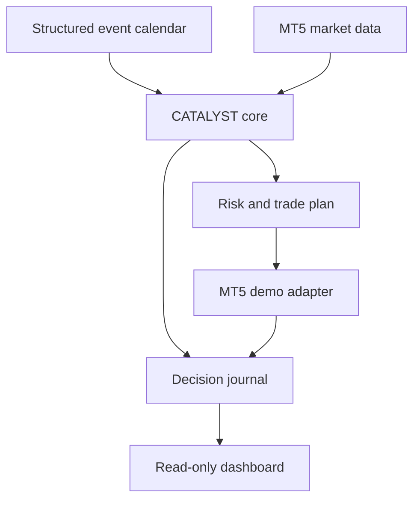
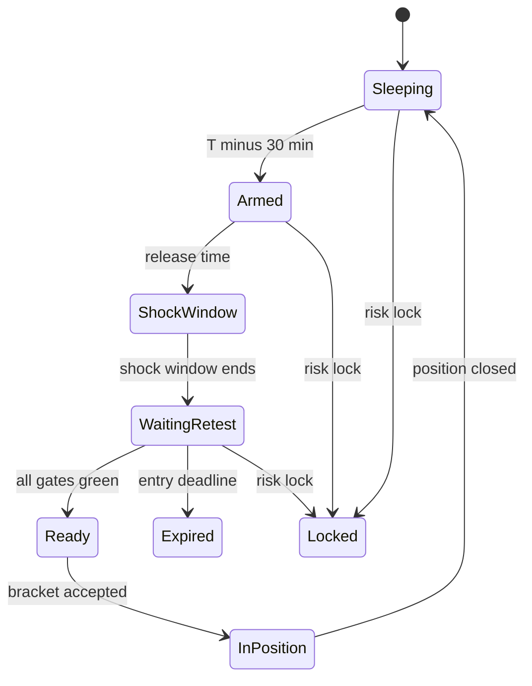

# Architecture

## Decision

Use a deterministic Python core with adapter boundaries. MT5 is a market-data
and demo-execution adapter, not the home of strategy rules. A small MQL5
guardian may be added only after Python demo execution is stable.

## Context diagram



## Component boundaries

| Component | Responsibility | Must not do |
| --- | --- | --- |
| Domain | Immutable events, snapshots, gates, plans, outcomes | Import MT5 or database packages |
| Strategy | Evaluate the documented setup gates | Calculate broker volume or send orders |
| State machine | Model event lifecycle explicitly | Read wall-clock time itself |
| Risk manager | Lock checks, risk amount, position sizing | Predict direction |
| Pipeline | Compose strategy and risk into one decision | Hide rejection reasons |
| Market-data port | Supply normalized snapshots | Contain strategy conditions |
| Event-feed port | Supply normalized scheduled events | Parse arbitrary prose in core |
| Broker port | Account state and bracket submission | Weaken or override risk decisions |
| Replay adapter | Feed historical inputs to the same pipeline | Reimplement strategy rules |
| Feature builder | Derive snapshots from ordered bid/ask evidence | Submit orders or alter risk |
| Exit engine | Evaluate explicit intraday exits from supplied quotes/time | Read a clock or widen stops |
| Journal | Append decisions, orders, fills, and state | Mutate historical records |
| Dashboard | Display and request safe control actions | Create numeric order parameters |

## Package target

```text
src/catalyst/
  domain/       immutable models and enums
  strategy/     Event Reaction Retest rules
  risk/         locks, sizing, and invariants
  engine/       state machine and decision pipeline
  replay/       raw fixtures, feature builder, clock, execution, reports
  ports/        protocols for external systems
  adapters/     fake, replay, MT5, calendar, and storage implementations
```

## Functional-core rule

The core receives all external state as arguments:

```text
decision = pipeline.evaluate(
    event,
    market_snapshot,
    account_snapshot,
    now,
    contract=broker_contract,
)
```

It must not call `datetime.now()`, random functions, network clients, MT5, or a
database. That makes the same decision callable by unit tests, event replay,
and demo execution.

The Phase 2 replay adapter serially composes `MarketFeatureBuilder`, the public
`DecisionPipeline`, `ReplayExecutionModel`, and `IntradayExitEngine`. It does
not contain a vectorized copy of strategy or risk rules. Replay supplies every
timestamp explicitly and orders equal timestamps by record type, logical
symbol, and source sequence.

## Event lifecycle



## Data flow

1. Scheduler loads the next eligible event.
2. Market adapter builds a normalized pre-event range and spread baseline.
3. State machine arms the event and enforces the no-trade shock window.
4. Strategy evaluates catalyst, acceptance, confirmation, and execution gates.
5. Risk manager applies account and portfolio locks and calculates `1R`.
6. Pipeline returns either a rejected decision or a complete trade plan.
7. Broker adapter validates symbol metadata and sends one idempotent bracket
   request to the verified demo account.
8. Journal stores request, check result, broker result, fills, and later exits.

## Idempotency

Each potential order needs a deterministic key:

```text
event_id + logical_symbol + strategy_version + direction + setup_sequence
```

The journal must reject a duplicate submitted key. A timeout is not permission
to resubmit until broker state and history have been reconciled.

Phase 3 implements this boundary with a unique immutable `order_intents` row
inserted only after the event and complete decision are durable. Lifecycle
changes are appended rather than updated. Reserved, submitting, and uncertain
states survive restart and can only be inspected through the broker-neutral
reconciliation port; they are never interpreted as permission to resubmit.

## Why MT5 is an adapter

Python is better suited to structured event data, replay, analysis, and a small
dashboard. MT5 remains useful for broker-specific prices and demo orders. The
adapter boundary also allows a later broker-native API without rewriting the
strategy.

## Why orchestration tools remain outside

n8n may later schedule reports and notifications. OpenClaw may later explain
journal data with read-only access. Neither belongs in the hot path because the
order path must be deterministic, replayable, low-latency enough for the chosen
post-shock window, and immune to prose or prompt manipulation.
